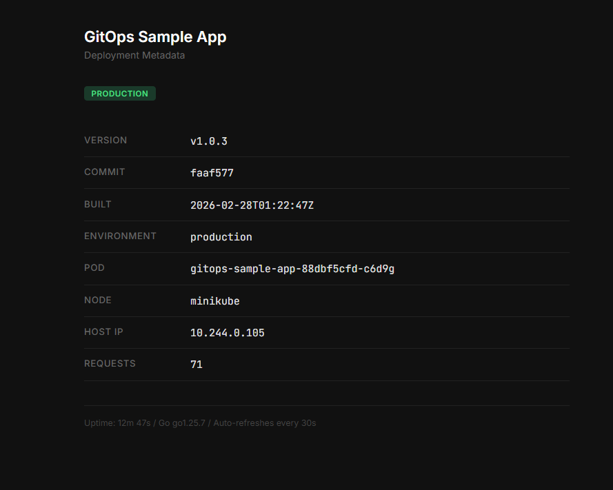
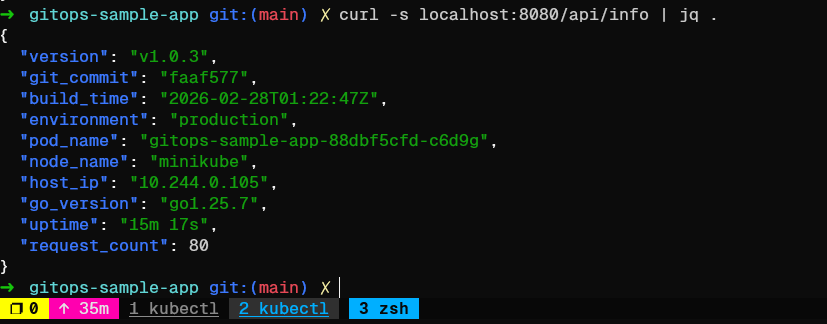
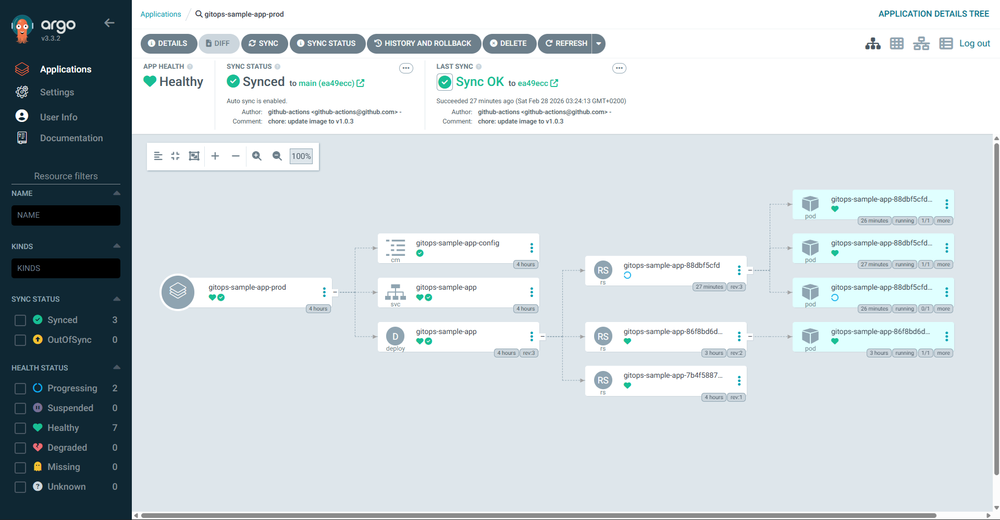

# GitOps Sample App

Inspired by this playlist [GitOps and K8s بالعربي](https://www.youtube.com/playlist?list=PLTRDUPO2OmInz2Fo41zwnoR1IArx70Hig).

## Main Challenges

| #   | Challenge                                                                                          | Artifact                                                                                                          |
| --- | -------------------------------------------------------------------------------------------------- | ----------------------------------------------------------------------------------------------------------------- |
| 1   | Build a Go web app that displays deployment metadata (version, commit, build time, env, pod, node) | [gitops-sample-app](https://github.com/moabdelazem/gitops-sample-app)                                             |
| 2   | Create a multi-stage Dockerfile with build args for metadata injection                             | [Dockerfile](https://github.com/moabdelazem/gitops-sample-app/blob/main/Dockerfile)                               |
| 3   | Create Kustomize manifests with base + per-environment overlays (dev/prod)                         | [gitops-sample-app-manifests](https://github.com/moabdelazem/gitops-sample-app-manifests)                         |
| 4   | Inject pod/node metadata automatically using Kubernetes Downward API                               | [base/deployment.yaml](https://github.com/moabdelazem/gitops-sample-app-manifests/blob/main/base/deployment.yaml) |
| 5   | Build a CI pipeline that builds/pushes Docker image and updates the manifests repo                 | [ci.yaml](https://github.com/moabdelazem/gitops-sample-app/blob/main/.github/workflows/ci.yaml)                   |
| 8   | Trigger CI on PR merge (dev) and semver tags (prod)                                                | [ci.yaml](https://github.com/moabdelazem/gitops-sample-app/blob/main/.github/workflows/ci.yaml)                   |
| 9   | Configure ArgoCD Applications for auto-sync with prune and self-heal                               | [application.yml](https://github.com/moabdelazem/gitops-sample-app-manifests/blob/main/application.yml)           |
| 10  | Separate namespaces per environment to avoid resource collisions                                   | [overlays/](https://github.com/moabdelazem/gitops-sample-app-manifests/tree/main/overlays)                        |

## Prerequisites

### Cluster

- Kubernetes cluster (Minikube, Kind, EKS, GKE, etc.)
- ArgoCD installed and configured
- `kubectl` access to the cluster

> **Note:** This project was tested and created on Minikube with Kubernetes v1.35.

### Client

- Go 1.25+
- Docker
- `git`
- `make`
- Docker Hub account with access token

## Application Endpoints

The app is simple — it provides information about the current deployment (`version`, `commit_sha`, `build_time`, `environment`, `pod_name`, `node_name`, `host_ip`, `request_count`) and runtime details (`go_version`, `uptime`).

```go
type AppInfo struct {
	Version     string `json:"version"`
	GitCommit   string `json:"git_commit"`
	BuildTime   string `json:"build_time"`
	Environment string `json:"environment"`
	PodName     string `json:"pod_name"`
	NodeName    string `json:"node_name"`
	HostIP      string `json:"host_ip"`
	GoVersion   string `json:"go_version"`
	Uptime      string `json:"uptime"`
	RequestCount int64  `json:"request_count"`
}
```

| Endpoint        | Description         |
| --------------- | ------------------- |
| `GET /`         | HTML dashboard      |
| `GET /healthz`  | Health check (JSON) |
| `GET /api/info` | All metadata (JSON) |

### HTML Dashboard



### API Response



## The CI Workflow

The pipeline is defined in [`.github/workflows/ci.yaml`](.github/workflows/ci.yaml) and consists of two jobs:

### Triggers

| Event               | Target | Image Tag      | Updates         |
| ------------------- | ------ | -------------- | --------------- |
| PR merged to `main` | Dev    | `<commit-sha>` | `overlays/dev`  |
| Tag push `v*`       | Prod   | `v1.x.x`       | `overlays/prod` |

### Jobs

**1. `build-and-push`**

- Checks out the app code
- Extracts build metadata (version, commit SHA, build time)
- Logs in to Docker Hub
- Builds and pushes the Docker image with the appropriate tag + `latest`

**2. `update-manifests`**

- Checks out the [manifests repo](https://github.com/moabdelazem/gitops-sample-app-manifests)
- Updates `newTag` in the target overlay's `kustomization.yaml` using `sed`:

  ```bash
  sed -i "s|newTag:.*|newTag: <new-tag>|" kustomization.yaml
  ```

  - `sed -i` — edit the file in-place
  - `s|pattern|replacement|` — substitute (using `|` as delimiter instead of `/`)
  - `newTag:.*` — match `newTag:` followed by anything
  - `newTag: <new-tag>` — replace with the new image tag (commit SHA or semver)

- Commits and pushes the change, triggering ArgoCD to sync

### Required Secrets

| Secret               | Description                                         |
| -------------------- | --------------------------------------------------- |
| `DOCKERHUB_USERNAME` | Docker Hub username                                 |
| `DOCKERHUB_TOKEN`    | Docker Hub access token                             |
| `MANIFESTS_PAT`      | GitHub PAT with `repo` scope for the manifests repo |

### Flow

```
PR merged to main ──► build-and-push ──► update overlays/dev ──► ArgoCD syncs dev
Tag v1.x.x pushed ──► build-and-push ──► update overlays/prod ──► ArgoCD syncs prod
```

## The Manifests

The Kubernetes manifests live in a separate repo: [gitops-sample-app-manifests](https://github.com/moabdelazem/gitops-sample-app-manifests).

### Base

Shared resources used by all environments: Namespace, Deployment, Service, and ConfigMap. The Deployment uses `envFrom` to load the ConfigMap and the Kubernetes Downward API to inject `POD_NAME` and `NODE_NAME`.

### Overlays

Each overlay sets its own namespace to avoid resource collisions:

| Overlay | Namespace                | Image Tag      | Replicas | APP_ENV       |
| ------- | ------------------------ | -------------- | -------- | ------------- |
| `dev`   | `gitops-sample-app-dev`  | `<commit-sha>` | 1        | `development` |
| `prod`  | `gitops-sample-app-prod` | `v1.x.x`       | 3        | `production`  |

### ArgoCD Applications

Both environments are defined in `application.yml` with `automated` sync policy, `prune`, and `selfHeal` enabled. ArgoCD watches the manifests repo and automatically applies changes when the CI updates the image tag.

```yaml
# application.yml
apiVersion: argoproj.io/v1alpha1
kind: Application
metadata:
  name: gitops-sample-app-dev
  namespace: argocd
spec:
  project: default
  source:
    repoURL: https://github.com/moabdelazem/gitops-sample-app-manifests.git
    targetRevision: main
    path: overlays/dev
  destination:
    server: https://kubernetes.default.svc
    namespace: gitops-sample-app-dev
  syncPolicy:
    automated:
      prune: true
      selfHeal: true
    syncOptions:
      - CreateNamespace=true
---
apiVersion: argoproj.io/v1alpha1
kind: Application
metadata:
  name: gitops-sample-app-prod
  namespace: argocd
spec:
  project: default
  source:
    repoURL: https://github.com/moabdelazem/gitops-sample-app-manifests.git
    targetRevision: main
    path: overlays/prod
  destination:
    server: https://kubernetes.default.svc
    namespace: gitops-sample-app-prod
  syncPolicy:
    automated:
      prune: true
      selfHeal: true
    syncOptions:
      - CreateNamespace=true
```



## Further Reading

- [ArgoCD Documentation](https://argo-cd.readthedocs.io/en/stable/)
- [Kustomize Documentation](https://kustomize.io/)
- [GitHub Actions Documentation](https://docs.github.com/en/actions)
- [Kubernetes Downward API](https://kubernetes.io/docs/concepts/workloads/pods/downward-api/)
- [Docker Multi-Stage Builds](https://docs.docker.com/build/building/multi-stage/)
- [Go ldflags](https://pkg.go.dev/cmd/link)
- [GitOps Principles](https://opengitops.dev/)
